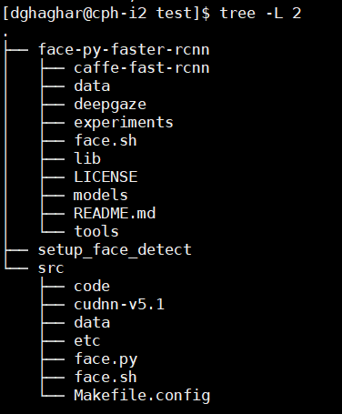

# Detect Face and Estimate Gaze

## Libraries Used

* [Face py-faster-rcnn](https://github.com/playerkk/face-py-faster-rcnn)
* [Deep Gaze](https://github.com/mpatacchiola/deepgaze)

## Setup to run on HPC Cluster

This setup wont require cloning this repo.

```sh
$ cd $PROJECT_PATH
$ wget "https://www.dropbox.com/s/ck98o2oa8ghgufe/setup_face_detect"
$ chmod +x setup_face_detect
$ ./setup_face_detect `pwd`
```

<p align="center">
  
</p>